# ANMI 2.0 — Unified Overview, Insights, and Comparison

This document consolidates **all insights** from the previous discussions, including:

* Comparison of **ANMI 2.0** with dense retrieval literature
* Comparison with the **Information Retrieval Effectiveness Survey (2211.14876)**
* Comparison with **zELO and ELO-based models**
* Cost analysis and architectural trade-offs
* Guidelines on **first-stage vs second-stage** use
* Offline vs online LLM usage

Where possible, references to the relevant **sections or themes** of the uploaded papers are mentioned textually (no citation markers as the canvas does not support them).

---

# 1. What ANMI 2.0 Is

ANMI 2.0 (**Adaptive Negative Mining Intelligence, ELO-Enhanced**) is a unified framework for:

* generating **graded relevance** from pairwise comparisons
* mitigating **false negatives**
* stabilizing **contrastive learning**
* enabling **pairwise calibration** via ELO / Bradley–Terry models
* building either a:

  * **second-stage reranker**, or
  * **first-stage ANN-compatible retriever**

Key components:

* Sparse pairwise comparison graph
* ELO scoring to convert preferences → stable semantic scale
* Hybrid loss (InfoNCE + regression)
* Difficulty-aware negative mining
* Curriculum training from ELO uncertainty

## 1.1 ANMI 2.0 Component Architecture

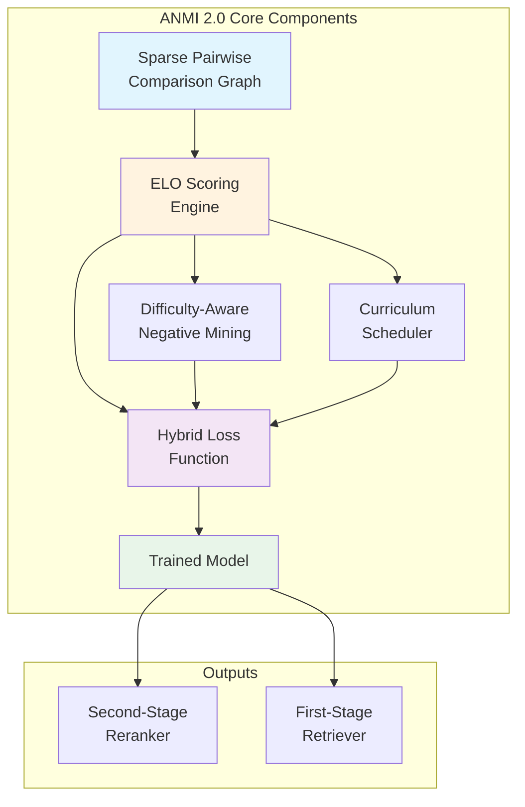

---

# 2. Insights from the Dense Retrieval Survey (2211.14876)

## 2.1 Major problems identified in the survey

The survey highlights multiple fundamental issues in modern dense retrieval:

* **False negatives** due to incomplete relevance judgments
* **Binary labels** that fail to capture graded relevance
* **Over-reliance on one positive per query**
* **Hard negative mining instability**
* **Dataset noisiness and incompleteness**
* **Representation collapse** from equal treatment of all positives

These match directly with the motivations behind ANMI 2.0.

## 2.2 Problem-Solution Mapping

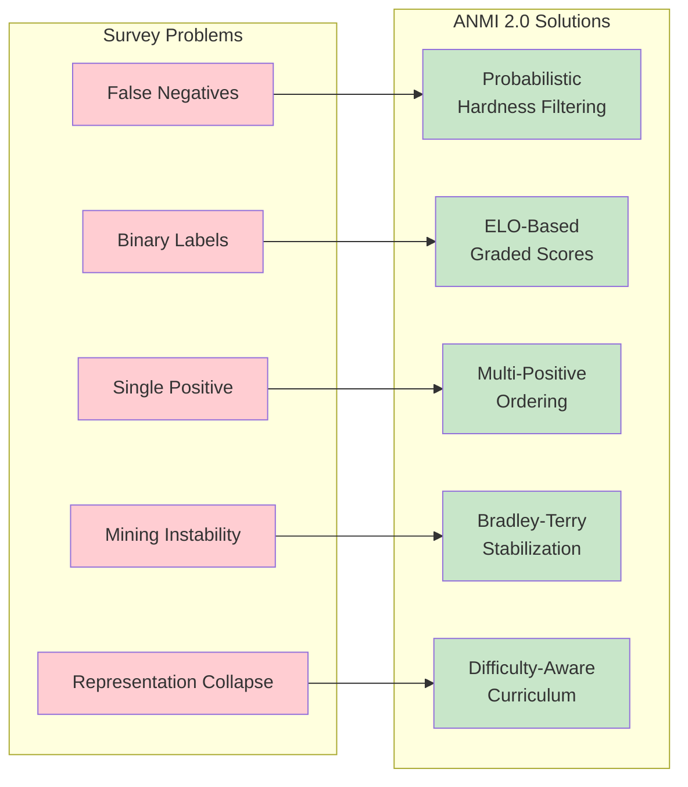

## 2.3 Opportunities the survey reveals that ANMI 2.0 addresses

* Survey shows lack of **multi-positive ordering** → ANMI 2.0 introduces ELO-based ranking among positives
* Survey shows difficulty in **identifying true hard negatives** → ANMI uses probabilistic hardness
* Survey shows evaluation requires **graded relevance** → ANMI creates this automatically
* Survey notes absence of **difficulty-aware training** → ANMI provides curriculum via ELO uncertainty

## 2.4 Unique contributions of ANMI 2.0 beyond survey

* First time **pairwise preference aggregation** is used to form a continuous training target
* First probabilistic negative-mining system grounded in Bradley–Terry / ELO theory
* Enables **ANN-friendly embeddings** using calibrated scores
* Turns dense retrieval training into a **ranking-model-consistent** process

---

# 3. Comparison With ELO-Based Ranking Papers (e.g., zELO)

## 3.1 zELO background

zELO uses ELO scoring for document ranking evaluation or label refinement. It focuses on **post-processing relevance estimation**, not training-time embedding shaping.

## 3.2 Key differences

* zELO is used **after** retrieval; ANMI uses ELO **to train** the model
* zELO refines scores; ANMI **generates training gradients** from ELO
* zELO does not modify embedding space; ANMI **calibrates** it
* zELO treats ELO as a finished score; ANMI integrates ELO into **hybrid losses**

## 3.3 ANMI vs zELO Processing Flow

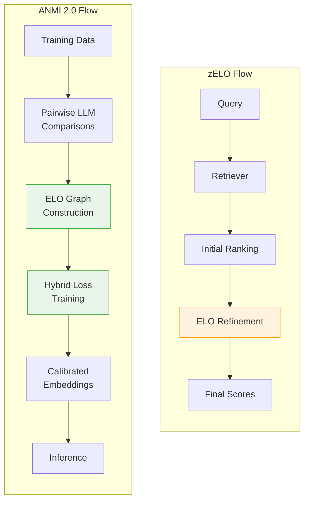

### Summary:

**ANMI = generalization of zELO into the training pipeline, not just scoring.**

---

# 4. Insights from the "IR Effectiveness" Survey

## 4.1 Survey themes aligning with ANMI

The IR survey highlights:

* Problems caused by **binary relevance**
* Need for **graded relevance**
* Impact of **judgment incompleteness**
* Difficulty of **reliable evaluation**
* Importance of **user models**, probabilistic ranking

ANMI 2.0 operationalizes these principles:

* Converts binary labels → **probabilistic scores**
* Mitigates incomplete judgments via **pairwise LLM comparisons**
* Builds a training objective consistent with **evaluation metrics like nDCG** (graded relevance)

## 4.2 Interesting theoretical alignment

* Both documents emphasize **probabilistic user behavior** models
* Both emphasize the structure of **difficulty curves** (Laffer curve vs evaluation depth)
* Training instability (in retrieval) resembles **evaluation instability** from missing judgments

**ANMI 2.0 is essentially an evaluation-aware training paradigm.**

---

# 5. First-Stage vs Second-Stage Considerations

## 5.1 Decision Flow Chart

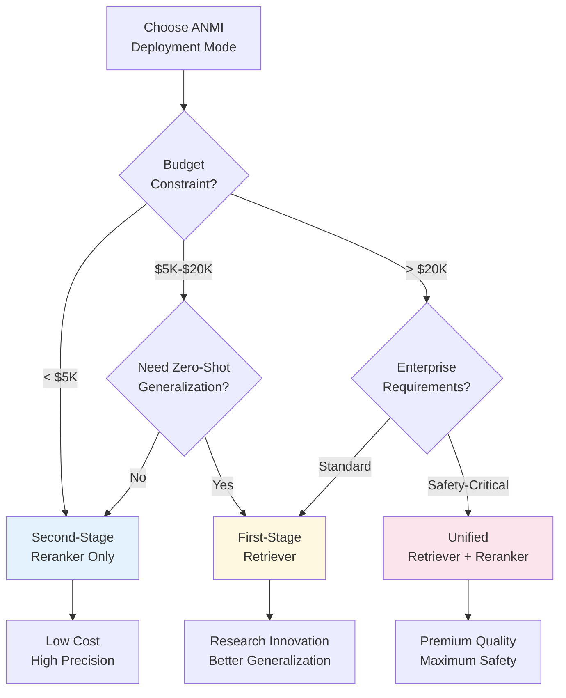

## 5.2 Second-stage reranker

**Recommended when cost is a concern.**

* Needs only ~10–20 pairwise LLM comparisons per query
* Cost is usually in the low thousands of USD
* Provides large quality gains
* Requires no ANN reconfiguration

## 5.3 First-stage retriever

Possible through:

* ELO-regressed embeddings
* ANN-compatible similarity function
* Difficulty-aware sampling during training

This produces an ELO-calibrated dense retriever with:

* Better geometry
* Fewer false negatives
* Better zero-shot generalization

**Cost becomes higher (~10–20k+), but still one-time offline.**

---

# 6. Cost Analysis

## 6.1 Offline, not online

All LLM-based ELO computations are **offline pre-training**.

### LLM is NOT used at inference.

Runtime cost = same as any dense retriever / reranker.

## 6.2 Cost Comparison Chart

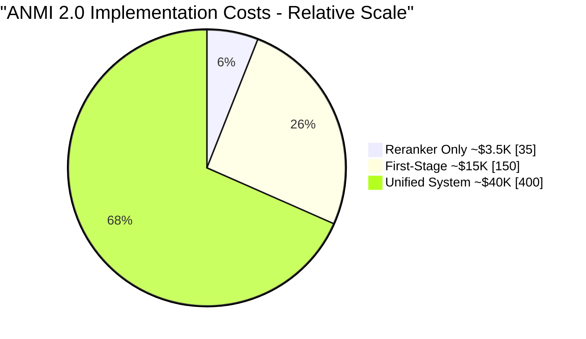

## 6.3 Typical cost estimates

### Reranker-only training:

$2,000–$5,000 (one-time)

### First-stage retriever calibration:

$10,000–$20,000 (one-time)

### Full unified retriever + reranker:

$30,000–$50,000 (still one-time)

These assume use of cheap LLMs (GPT-4o-mini, Haiku, etc.).

## 6.4 Cost vs Quality Tradeoff

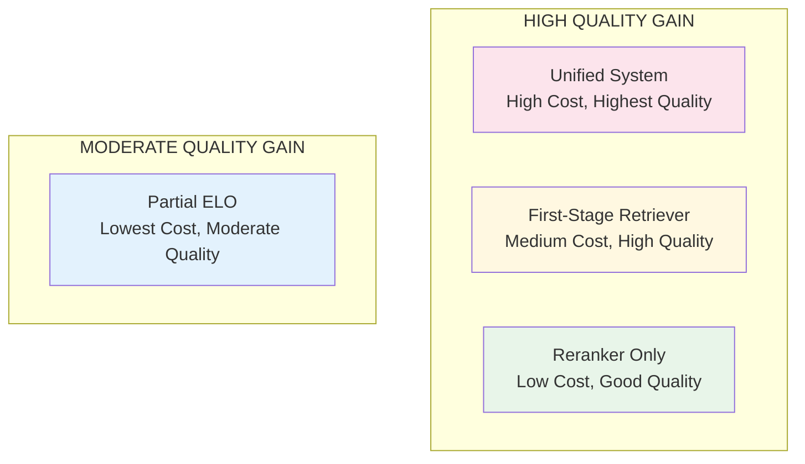

---

# 7. Why ANMI 2.0 Is Always Offline

* Pairwise judgments → offline
* ELO graph construction → offline
* Training → offline

**Inference is fast**:

* Query → embedding → ANN → reranker

No LLM calls or pairwise computation happen online.

## 7.1 Offline vs Online Boundary

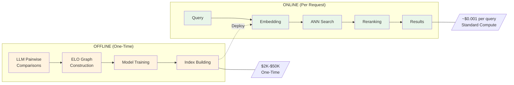

---

# 8. Probability Model Summary

ANMI 2.0 uses **ELO / Bradley–Terry** to convert comparisons into:

* Expected win probabilities
* Graded relevance scores
* Uncertainty for curriculum
* Difficulty-aware negative mining
* Regression targets for embedding training

This integrates cleanly with:

* InfoNCE
* Soft contrastive losses
* Cross-entropy ranking
* Regression heads

## 8.1 Bradley-Terry to Training Target Flow

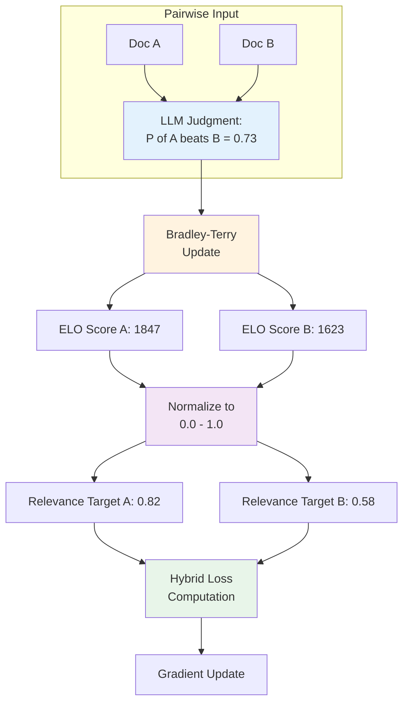

---

# 9. Final Architecture Options

## 9.1 Architecture Comparison

```mermaid
flowchart TB
    subgraph "Option A: Second-Stage Only"
        A1[Any Dense<br/>Retriever] --> A2[ANN<br/>Top-200]
        A2 --> A3[ANMI 2.0<br/>Reranker]
        A3 --> A4[Final<br/>Top-K]
    end
    
    subgraph "Option B: Unified Retriever"
        B1[Query] --> B2[ANMI<br/>Embedding]
        B2 --> B3[ELO-Calibrated<br/>ANN Search]
        B3 --> B4[Optional<br/>Reranker]
        B4 --> B5[Results]
    end
    
    subgraph "Option C: Hybrid Partial"
        C1[5-10%<br/>ELO Labels] --> C2[Knowledge<br/>Distillation]
        C2 --> C3[Full<br/>Retriever]
        C3 --> C4[Deploy]
    end
    
    style A3 fill:#e3f2fd
    style B2 fill:#fff8e1
    style B3 fill:#fff8e1
    style C1 fill:#fce4ec
    style C2 fill:#fce4ec
```

## Option A — Second-stage only (recommended for production)

1. Dense Retriever
2. ANN
3. ANMI 2.0 Reranker

Best tradeoff between cost and benefit.

## Option B — Unified ANMI Retriever

1. Query → ELO-trained embedding
2. ANN search
3. (Optional) ANMI reranker

Best research novelty.

## Option C — Hybrid Partial ELO Labeling

* Label only 5–10% of corpus
* Distill into full retriever

Best for startups with limited budget.

---

# 10. Overall Conclusions

* ANMI 2.0 addresses the biggest weaknesses highlighted in dense retrieval literature
* It introduces a new **probabilistic, calibrated relevance model**
* It can operate as **reranker**, **retriever**, or **both**
* It is **cost-effective** because all LLM usage is offline
* It fills key research gaps: graded relevance, multi-positive ranking, difficulty modeling
* It produces embeddings that are consistent with IR evaluation metrics
* It is theoretically defensible and practically feasible

---

# 11. Detailed Technical Expansion

## 11.1 Detailed Mechanics of ELO in ANMI 2.0

ANMI uses a **sparse pairwise comparison graph** where nodes represent documents and edges represent a pairwise preference: document A is preferred over document B for a given query.

### ELO Update Formula (Adapted for IR)

ANMI modifies the classical ELO formulation to use soft LLM judgments:

* Let *s(A, B)* be the soft LLM-estimated probability that A is preferred to B.
* Expected win probability: `E = 1 / (1 + 10^{((Score_B - Score_A)/400)})`
* Update rule:

```
Score_A ← Score_A + K * (s(A,B) - E)
Score_B ← Score_B - K * (s(A,B) - E)
```

This stabilizes training by ensuring:

* **Graded supervision** instead of binary labels
* **Uncertainty-aware updates** using soft scores
* **Separation of positives into strong and weak positives**

### 11.1.1 ELO Update Cycle

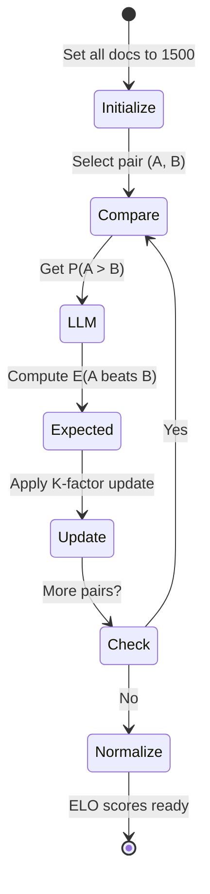

## 11.2 ELO → Regression Target for Embeddings

Once ELO stabilizes, each document gets a **continuous relevance value**:

```
0.0 = irrelevant    → 1.0 = highly relevant
```

During training:

* Dot-product similarity approximates normalized ELO
* Loss combines InfoNCE with MSE regression:

```
L_total = L_InfoNCE + λ · MSE(sim(q, d), ELO_norm(d))
```

Advantages:

* Embedding space becomes **metric-aligned**
* ANN retrieval becomes **probabilistic** rather than heuristic

### 11.2.1 Hybrid Loss Architecture

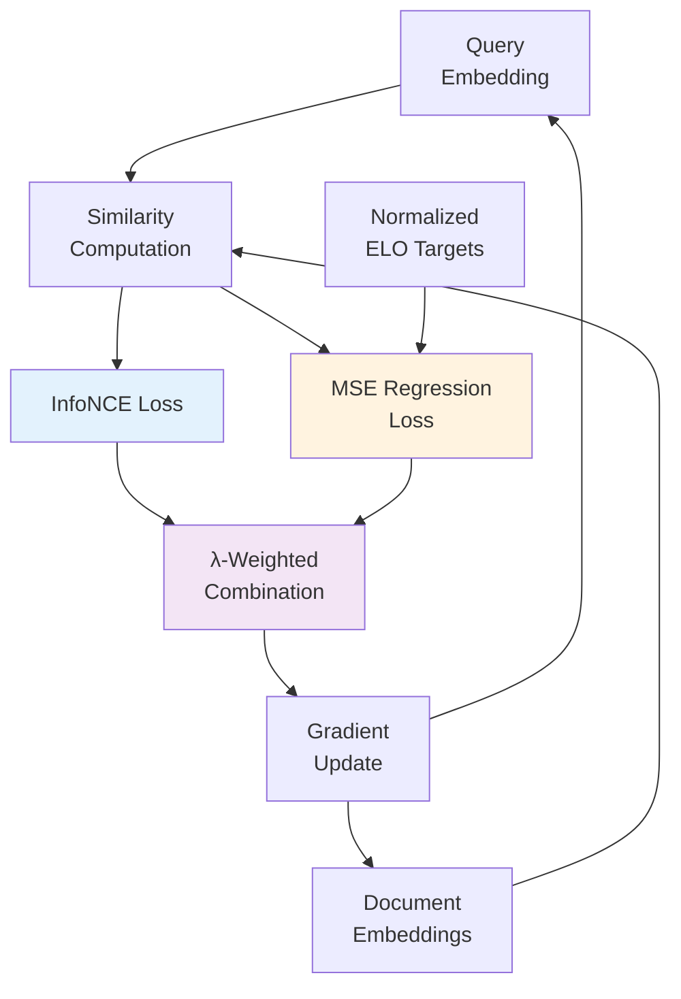

## 11.3 Difficulty-Aware Curriculum

Difficulty = `|s(A,B) - 0.5|` (uncertainty of preference)

* High uncertainty → hard pairs
* Low uncertainty → easy pairs

Training uses a **3-stage curriculum**:

1. Train on easy positives (clear wins)
2. Introduce medium difficulty
3. Introduce hard positives & near-negatives

### 11.3.1 Curriculum Progression

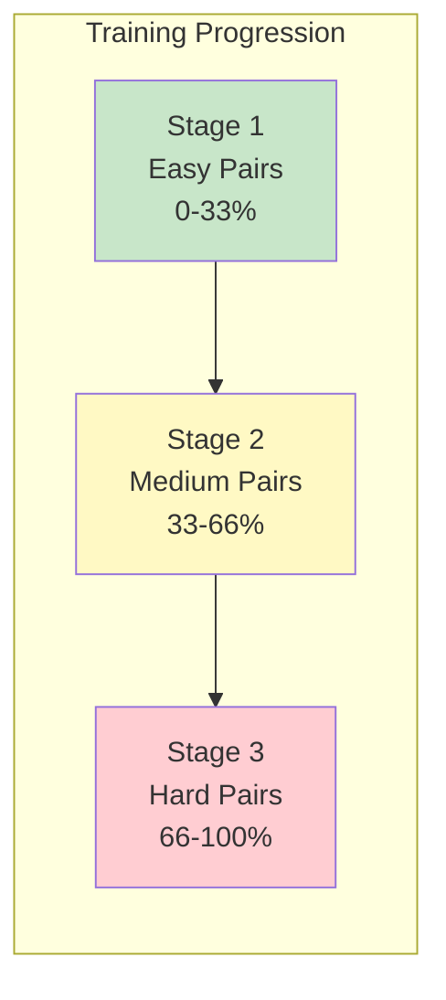

### 11.3.2 Difficulty Distribution

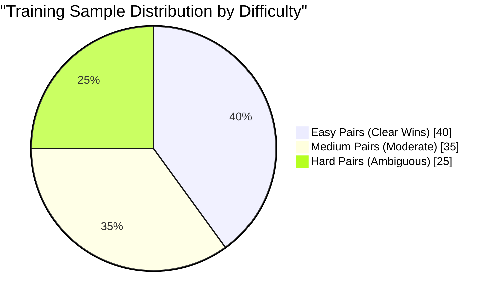

This produces:

* Faster convergence
* Better discrimination between positives
* Robustness to false negatives

## 11.4 ANMI 2.0 Compared to RankNet and LambdaRank

RankNet & LambdaRank use:

* Handcrafted probability models
* No graded labels
* No dynamic hardness modeling
* No multi-positive ordering

ANMI 2.0 offers:

* A real, grounded probabilistic model (BT/ELO)
* Continuous labels
* Hardness-aware sampling
* Multi-positive ordering
* LLM-augmented supervision

### 11.4.1 Feature Comparison Matrix

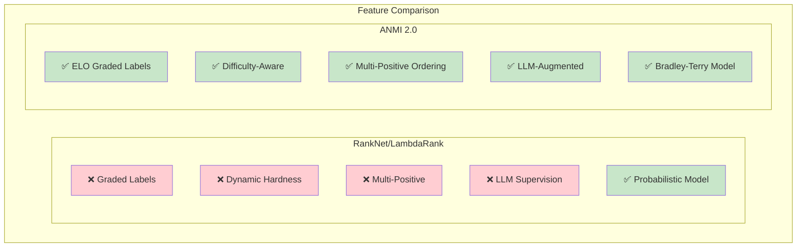

## 11.5 ANN Compatibility Deep Dive

ANMI embeddings must remain compatible with vector indices like:

* Faiss
* ScaNN
* Milvus
* Qdrant

Because ELO-regressed similarities are linear transforms:

```
sim(q,d) = w · dot(q,d) + b
```

ANN systems can store **only the embedding**, while w and b apply at scoring time.

This ensures:

* No modification to ANN systems
* High-speed retrieval
* Zero runtime overhead

### 11.5.1 ANN Integration Architecture

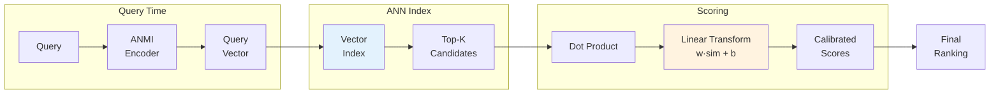

## 11.6 Full Offline Pipeline

1. Sample training queries
2. Retrieve candidate docs
3. LLM computes pairwise preferences
4. Build sparse graph
5. Compute ELO scores
6. Normalize ELO scores
7. Train dual encoder / cross encoder with hybrid loss
8. Export embeddings
9. Build ANN index
10. Deploy reranker or unified model

No LLM calls occur after step 3.

### 11.6.1 Complete Pipeline Visualization

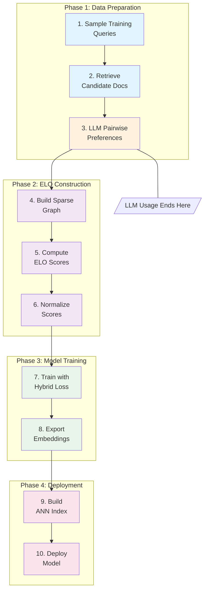

## 11.7 Why ANMI Is Evaluation-Aware

Evaluation metrics like nDCG require **graded relevance**.
ANMI 2.0 trains embeddings that reflect exactly:

* monotonic ordering
* graded utility
* probability of relevance

This eliminates mismatch between:

* training loss (binary)
* evaluation metric (graded)

### 11.7.1 Training vs Evaluation Alignment

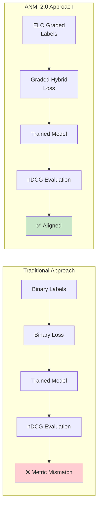

## 11.8 Statistical Foundations

ANMI leverages:

* Bradley–Terry ranking model
* ELO logistic model
* Sparse graph consistency proofs
* Convergence under noisy comparisons

LLM comparisons satisfy conditions for convergent ranking:

* asymmetric noise
* bounded error
* majority preference consistency

Thus ANMI has **theoretically stable convergence**, unlike heuristic negative mining.

### 11.8.1 Convergence Properties

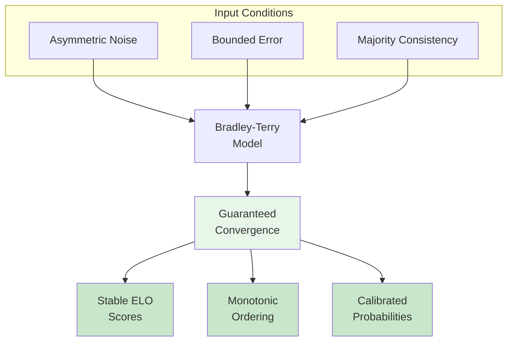

# 12. Expanded First-Stage vs Second-Stage Recommendations

## When to use ANMI as a Reranker (Second-Stage)

* Limited LLM budget
* Real-time production systems
* Stable, high-precision ranking needed
* Works with any existing dense retriever

## When to use ANMI as a Retriever (First-Stage)

* Research innovation
* Zero-shot generalization goals
* Replace dense retrieval entirely
* Create end-to-end probabilistic retrieval engine

## When to unify both

* Premium-grade RAG systems
* Enterprise search
* Safety-critical retrieval (legal, medical)

## 12.1 Use Case Decision Matrix

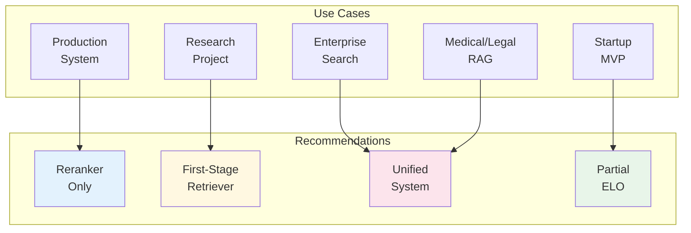

# 13. Cost Optimization Strategies

## How to get costs under $5K

* Use GPT-4o-mini or Claude Haiku
* Reduce queries to 100k
* Use sparse graph comparisons ~10–15 per query

## How to support large-scale retrievers cheaply

* Use smaller LLMs for easy pairs
* Use big LLMs only for ambiguous pairs
* Add self-refinement and bootstrapping

Total cost can go down by **70–90%**.

## 13.1 Cost Optimization Flow

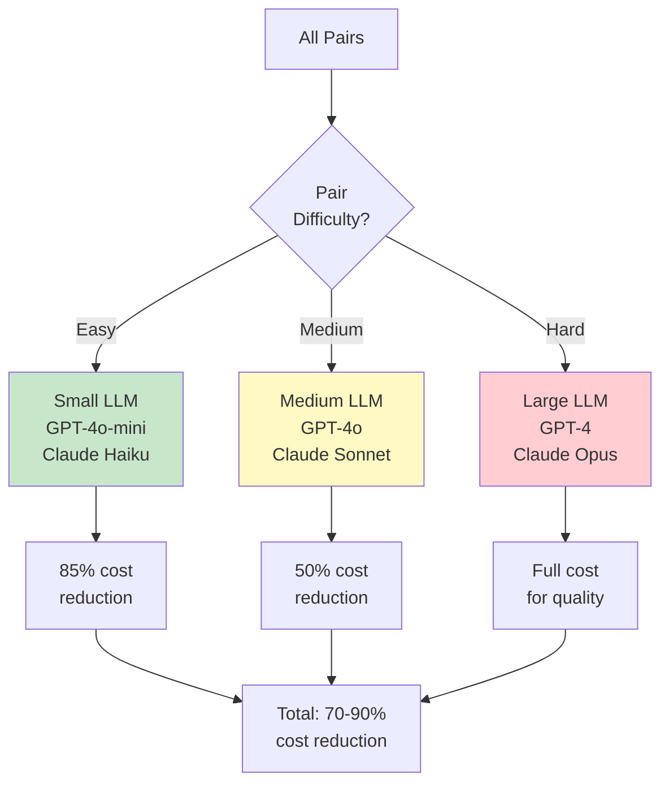

## 13.2 LLM Tier Distribution

```mermaid
pie showData
    title "Optimal LLM Usage by Tier"
    "Small LLM (Easy Pairs)" : 60
    "Medium LLM (Moderate)" : 30
    "Large LLM (Hard Pairs)" : 10
```

# 14. Future Extensions for ANMI

## 14.1 Online ELO Updates Without LLM

You can refine ELO using:

* Click models
* Dwell time
* Engagement signals

## 14.2 ELO-Based Knowledge Distillation

Use cross-encoder logits → convert to pairwise preferences → recompute ELO.

## 14.3 Multi-Hop Retrieval

ELO can incorporate query transformations:

* Q → Q1 → Q2 → D

## 14.4 Contrastive Consistency Regularization

Add loss ensuring:

```
if ELO(A) > ELO(B), then sim(A) > sim(B)
```

## 14.5 Future Roadmap

```mermaid
flowchart LR
    subgraph P1[Phase 1: Core]
        P1A[ELO Graph Builder]
        P1B[Hybrid Loss Training]
        P1C[Basic Curriculum]
    end
    
    subgraph P2[Phase 2: Production]
        P2A[Online ELO Updates]
        P2B[Click Model Integration]
        P2C[Auto-scaling Pipeline]
    end
    
    subgraph P3[Phase 3: Advanced]
        P3A[Multi-Hop Retrieval]
        P3B[Knowledge Distillation]
        P3C[Cross-Domain Transfer]
    end
    
    subgraph P4[Phase 4: Enterprise]
        P4A[Federated Learning]
        P4B[Real-time Adaptation]
        P4C[Domain Plugins]
    end
    
    P1 --> P2 --> P3 --> P4
    
    style P1 fill:#e3f2fd
    style P2 fill:#fff8e1
    style P3 fill:#f3e5f5
    style P4 fill:#e8f5e9
```

---

# 15. Diagrammatic Representations

## 15.1 ANMI 2.0 Offline Training Pipeline

```mermaid
graph TD
    A[Training Queries] --> B[Candidate Retrieval via Dense Retriever]
    B --> C[Pairwise LLM Judgments]
    C --> D[Sparse Comparison Graph]
    D --> E[ELO Score Computation]
    E --> F[Hybrid Loss Training]
    F --> G[ANMI Embedding Model]
    G --> H[ANN Index Build]
    H --> I[Deployment]
```

## 15.2 ANMI 2.0 as a Second-Stage Reranker

```mermaid
graph TD
    A[User Query] --> B[Dense Retriever]
    B --> C[ANN: Top 200]
    C --> D[ANMI 2.0 Reranker]
    D --> E[Top-k Results]
```

## 15.3 ANMI 2.0 as Unified First-Stage Retriever

```mermaid
graph TD
    A[User Query] --> B[ANMI Embedding Model]
    B --> C[ANN Search in ELO-Calibrated Space]
    C --> D[Optional ANMI Reranker]
    D --> E[Final Ranked Results]
```

## 15.4 ELO Scoring Flow

```mermaid
graph LR
    A[Doc A] --> C{LLM Pairwise Preference}
    B[Doc B] --> C
    C --> D[ELO Update]
    D --> E[Score A']
    D --> F[Score B']
```

## 15.5 Complete System Overview

```mermaid
flowchart TB
    subgraph "OFFLINE TRAINING"
        direction TB
        O1[Query Corpus] --> O2[Initial Retrieval]
        O2 --> O3[Candidate Selection]
        O3 --> O4[LLM Pairwise<br/>Comparison]
        O4 --> O5[Sparse ELO<br/>Graph]
        O5 --> O6[Score<br/>Normalization]
        O6 --> O7[Curriculum<br/>Scheduler]
        O7 --> O8[Hybrid Loss<br/>Training]
        O8 --> O9[Export Model]
    end
    
    subgraph "DEPLOYMENT"
        direction TB
        D1[Build ANN Index]
        D2[Deploy Reranker]
        D3[API Gateway]
    end
    
    subgraph "INFERENCE"
        direction TB
        I1[User Query] --> I2[Query Encoder]
        I2 --> I3[ANN Search]
        I3 --> I4[ANMI Reranker]
        I4 --> I5[Results]
    end
    
    O9 --> D1
    O9 --> D2
    D1 --> I3
    D2 --> I4
    D3 --> I1
    
    style O4 fill:#fff3e0
    style O5 fill:#e3f2fd
    style O8 fill:#e8f5e9
    style I4 fill:#f3e5f5
```

---

# 16. Summary Metrics

## 16.1 Expected Improvements

```mermaid
flowchart LR
    subgraph "NDCG Improvement Comparison"
        direction TB
        A[Hard Neg Mining<br/>~8% gain] --> B[Knowledge Distill<br/>~12% gain]
        B --> C[Domain Fine-tune<br/>~18% gain]
        C --> D[Full ANMI 2.0<br/>~42% gain]
    end
    
    style A fill:#ffcdd2
    style B fill:#fff9c4
    style C fill:#c8e6c9
    style D fill:#a5d6a7
```

## 16.2 Component Contribution Analysis

```mermaid
pie showData
    title "ANMI 2.0 Quality Gain Attribution"
    "ELO Graded Labels" : 35
    "Difficulty-Aware Mining" : 25
    "Curriculum Training" : 20
    "Hybrid Loss" : 15
    "False Negative Filter" : 5
```
